# Computer Graphics

### Project 1: Blender
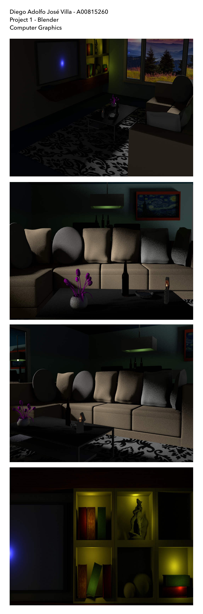

### Project 2: POV Ray

### HW 1: Blender
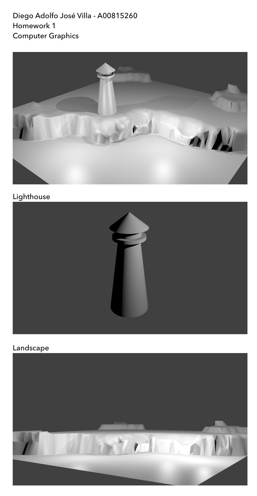

### HW 2: Blender
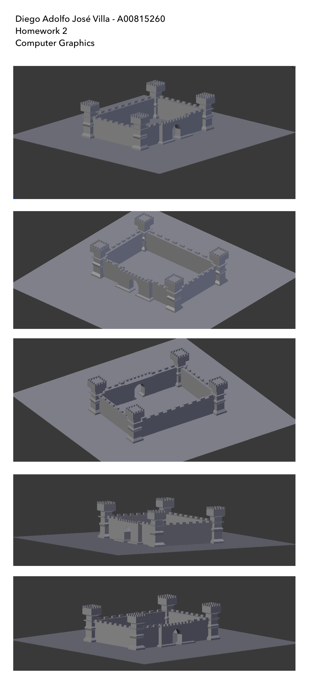

### HW 3: Blender

### HW 4: Blender
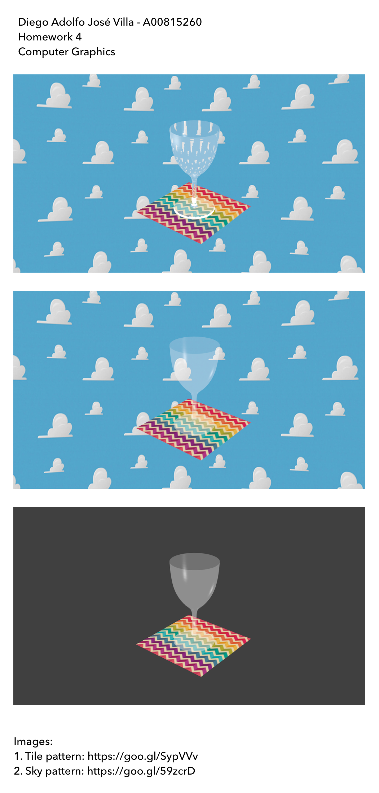

### HW 5: POV RAY
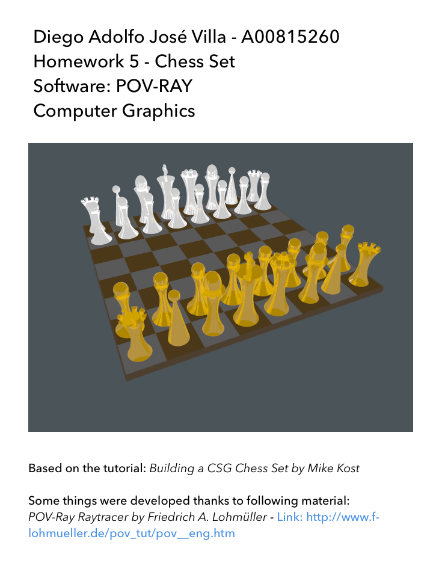

### HW 6: POV RAY
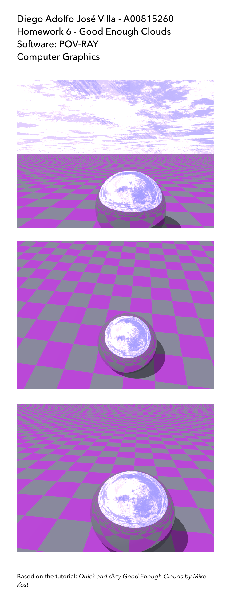

### HW 7: POV RAY
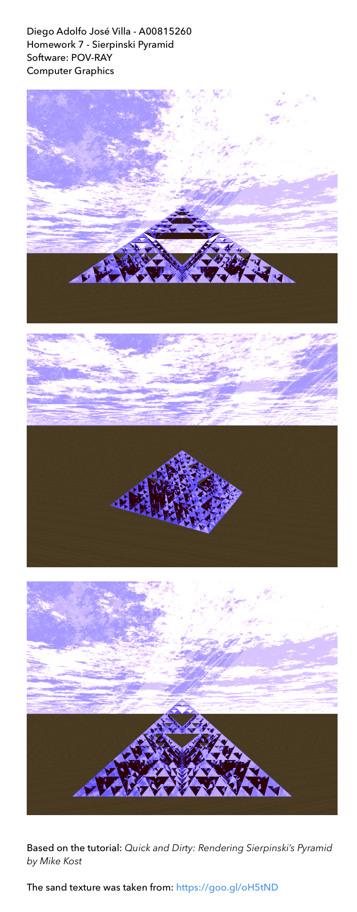

### HW 8: POV RAY
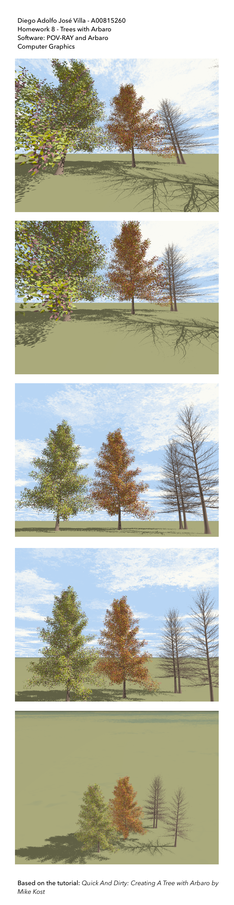

### HW 9: Octave
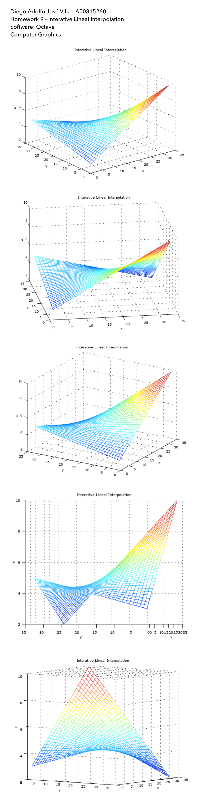

### HW 10: OpenGL
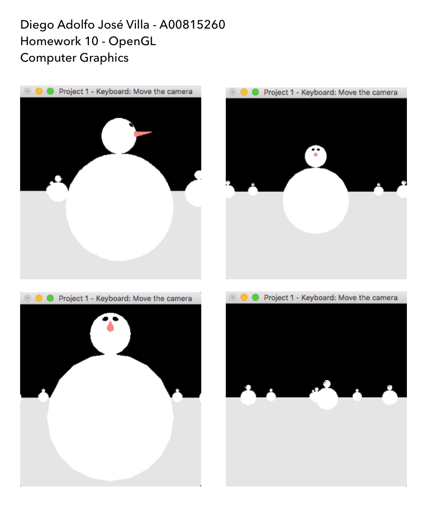

### HW 11: OpenGL
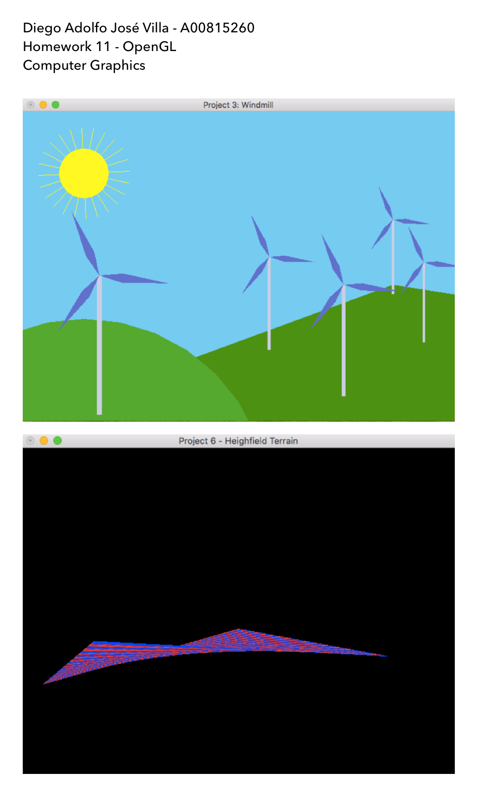