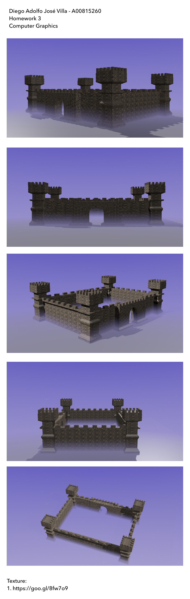

# Computer Graphics

### HW 1: Blender

### HW 2: Blender

### HW 3: Blender

### HW 4: Blender

### HW 5: POV RAY

### HW 6: POV RAY

### HW 7: POV RAY

### HW 8: POV RAY

### HW 9: Octave

### HW 10: OpenGL

### HW 11: OpenGL

